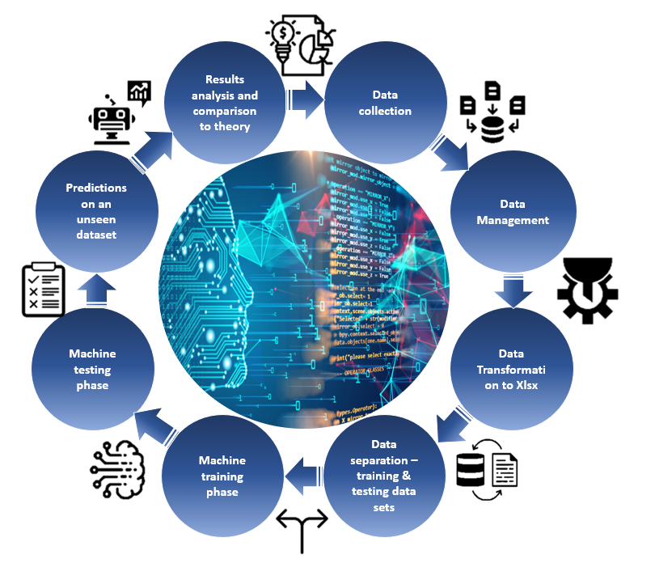

# Machine_Learning_for_Data_Analysis
This project is part of my B.Sc thesis and it includes a Machine Learning model (Multi Linear Regrssion - MLR) for analysis of the collected data according to the hydrogen generator by the Arduino Mega project.

The following picture represents the thesis life cycle:

The research life cycle starts with data collection based on the control & measurement system and the dedicated data logger. Then, the data is managed and extracted from the text file of the data logger to a vector format shape. Then the entire data is cleaned using two algorithms, the first for dealing with "NULL" measurements which are received while the system isn't able to sample correctly, and the second for dealing with outliers and removing them from the data set. After getting a clear data set, it is written into an Excel file. The entire data is separated into two categories – training set & testing set while the ratio is 2/3 for the goodness of the training set. A Multiple Linear Regression model is used in the machine training phase to learn the entire system's behavior. Then the rest of the original data is used to test the machine learning model after finishing the training phase and to estimate the machine's performance and accuracy rate. The last step of the machine learning process is to test it on an unseen dataset to get enough processed data according to the system's performance. The unseen data set is based on the data which was collected using the data logger, and its building is done according to the minimum and maximum values of the original data. The thesis life cycle ends with the analysis of the results and comparing them to the theoretical level.

